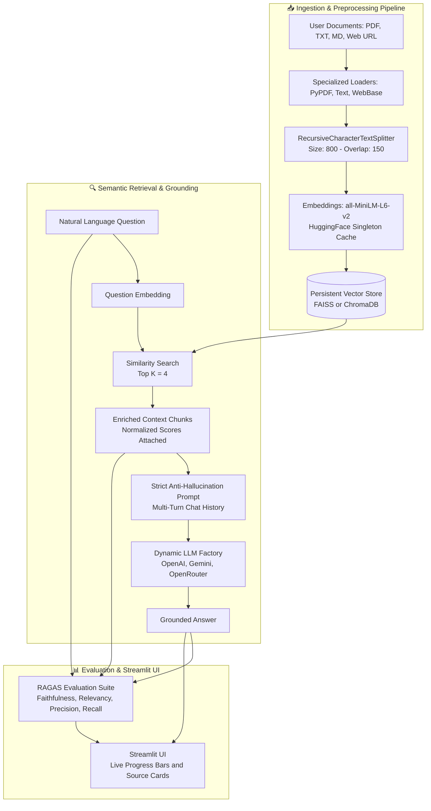

# 🧩 SmartRag — Production-Ready AI Research Assistant

<div align="center">
  <p><strong>A modular, non-hallucinating Retrieval-Augmented Generation (RAG) application built with Python 3.12+, Streamlit, LangChain, FAISS/ChromaDB, and RAGAS.</strong></p>
</div>

---

## 📖 Project Overview

**SmartRag** is an AI-powered Research Assistant that allows users to upload complex documents (PDFs, plain text, markdown, and web URLs) and ask questions in natural language. 

Unlike standard LLM chat applications that often fabricate facts, **SmartRag is strictly grounded in retrieved context**. If an answer cannot be found in the uploaded documents, the system explicitly replies:
> *"I could not find this information in the uploaded documents."*

Every response is accompanied by **expandable source citations** detailing the exact document name, page number, similarity score, and raw chunk text.

---

## 🏛️ Architecture Diagram



---

## ✨ Features

- **📑 Multi-Format Document Upload**: Seamless ingestion of `PDF`, `TXT`, `MD`, and live **Web URLs**.
- **📚 Multi-Document Indexing**: Upload and process dozens of research papers simultaneously with live progress bars (`Load -> Split -> Embed -> Store`).
- **🎯 Optimal Context Chunking**: Uses `RecursiveCharacterTextSplitter` with `CHUNK_SIZE=800` and `CHUNK_OVERLAP=150` for high semantic density.
- **⚡ Local Fast Embeddings**: Pre-loaded singleton `sentence-transformers/all-MiniLM-L6-v2` (`384` dimensions) for zero-API-cost indexing.
- **🔍 Pluggable Vector Databases**: Full support for both **FAISS** (ultra-fast in-memory/local indexing) and **ChromaDB** (persistent SQLite storage).
- **🤖 Multi-Provider LLM Factory**: Switch effortlessly between **OpenAI (`gpt-4o-mini`)**, **Google Gemini (`gemini-1.5-pro`)**, and **OpenRouter** directly from the UI sidebar without restarting.
- **🛡️ 100% Grounded Responses**: Enforces strict `0.0` temperature and systemic anti-hallucination guardrails.
- **📑 Verifiable Source Citations**: Every turn displays expandable cards showing **Document Name**, **Page Number**, **Chunk Text**, and exact **Similarity Score**.
- **💬 Multi-Turn Conversation Memory**: Retains full chat history across the session, allowing pronoun resolution and follow-up inquiries.
- **📊 Live RAGAS Evaluation**: Automatically computes **Faithfulness**, **Answer Relevancy**, **Context Precision**, and **Context Recall** with visual progress indicators on every turn.
- **🌙 Modern Dark-Theme UI**: Responsive Streamlit interface equipped with loading spinners, progress bars, and management action buttons (`Clear Chat`, `Clear DB`, `Re-index`).

---

## 🛠️ Installation

### 1. Prerequisites
Ensure you have **Python 3.12 or higher** installed:
```bash
python --version
```

### 2. Clone or Navigate to Project Directory
```bash
cd SmartRag
```

### 3. Create Virtual Environment & Install Dependencies
```bash
# Windows (PowerShell)
python -m venv venv
.\venv\Scripts\activate

# Install required packages
pip install -r requirements.txt
```

---

## 🔑 Environment Variables

Copy the provided example configuration file to create your local `.env`:
```bash
copy .env.example .env
```

Open `.env` and insert your API keys:
```ini
# Primary LLM Provider API Keys
OPENAI_API_KEY=your_openai_api_key_here
GOOGLE_API_KEY=your_google_gemini_api_key_here
OPENROUTER_API_KEY=your_openrouter_api_key_here

# RAG Configuration Defaults
DEFAULT_LLM_PROVIDER=openai
DEFAULT_EMBEDDING_MODEL=all-MiniLM-L6-v2
CHUNK_SIZE=800
CHUNK_OVERLAP=150
TOP_K=4
TEMPERATURE=0.0
```
> **Note:** You can also enter API keys directly into the **Streamlit Sidebar** at runtime.

---

## 🚀 Running Instructions

Launch the application locally with a single command:
```bash
streamlit run app.py
```
The application will open automatically in your default web browser at `http://localhost:8501`.

---

## 📂 Folder Structure

```text
SmartRag/
│
├── app.py                     # Top-level Streamlit entry point with dark-theme configuration
├── config.py                  # Centralized path constants, hyper-parameters, and provider settings
├── requirements.txt           # Production package dependencies
├── README.md                  # Comprehensive project documentation
├── .env.example               # Template environment configuration file
├── .gitignore                 # Git ignore rules for runtime stores and API keys
│
├── assets/                    # Placeholder directory for static assets and logos
├── uploads/                   # Runtime storage for uploaded user documents
├── vector_store/              # Persistent local storage for FAISS and ChromaDB indexes
│
├── prompts/
│      __init__.py             # Prompts package export
│      prompt.py               # Strict anti-hallucination system prompt & ChatPromptTemplates
│
├── loaders/
│      __init__.py             # Unified document loader dispatch (`load_document`)
│      pdf_loader.py           # PyPDFLoader wrapper with metadata standardization (1-indexed pages)
│      text_loader.py          # Multi-encoding fallback loader for .txt and .md files
│      web_loader.py           # WebBaseLoader wrapper with URL domain extraction
│
├── chunking/
│      __init__.py             # Chunking package export
│      splitter.py             # DocumentSplitter around RecursiveCharacterTextSplitter (800/150)
│
├── embeddings/
│      __init__.py             # Embeddings package export
│      embedding_model.py      # Singleton caching wrapper around all-MiniLM-L6-v2
│
├── database/
│      __init__.py             # Vector store factory (`get_vector_database`)
│      faiss_db.py             # FAISSDatabaseManager with safe local deserialization
│      chroma_db.py            # ChromaDatabaseManager with SQLite persistence
│
├── retriever/
│      __init__.py             # Retriever package export
│      retriever.py            # SmartRetriever performing Top-K similarity search & score normalization
│
├── llm/
│      __init__.py             # LLM package export
│      llm_factory.py          # Factory Design Pattern for OpenAI, Gemini, and OpenRouter models
│
├── chains/
│      __init__.py             # Chains package export
│      rag_chain.py            # SmartRAGChain LCEL pipeline with conversation memory & strict grounding
│
├── evaluation/
│      __init__.py             # Evaluation package export
│      ragas_eval.py           # RAGAS evaluation suite with heuristic fallback scoring
│
├── utils/
│      __init__.py             # Utilities package export
│      helpers.py              # File management, statistics calculation, and display helpers
│
└── ui/
       __init__.py             # UI components package export
       sidebar.py              # Streamlit sidebar component (sliders, uploaders, progress bars)
       chat.py                 # Main page interface (chat loop, expandable sources, RAGAS bars)
```

---

## 🖼️ Screenshots Placeholder

| **Main Chat Interface & Source Citations** | **Sidebar Configuration & Ingestion Progress** |
| :---: | :---: |
| ** | ** |
| Shows grounded response, expandable source card with exact page number and similarity score, alongside live RAGAS evaluation bars. | Shows multi-file PDF upload, Top K/Chunk sliders, LLM provider selection, and indexing status indicators. |

---

## 🔮 Future Improvements

- **⚡ Hybrid Search**: Combine dense semantic similarity with sparse BM25 keyword matching for exact technical code/acronym lookup.
- **📑 Document Summarization**: Add a dedicated UI tab to generate executive summaries of newly uploaded research papers.
- **🎙️ Voice Input/Output**: Integrate OpenAI Whisper API for voice-driven research queries and ElevenLabs/TTS audio readout.
- **👁️ OCR Support**: Incorporate `pytesseract` or `unstructured` OCR capabilities to parse scanned image-based PDF documents.
- **🌐 Multi-Language Queries**: Auto-translate multilingual user inquiries to match cross-lingual vector space representations.
- **📥 Export Chat Session**: Allow users to download full conversation transcripts and source citations as formatted Markdown or PDF reports.
